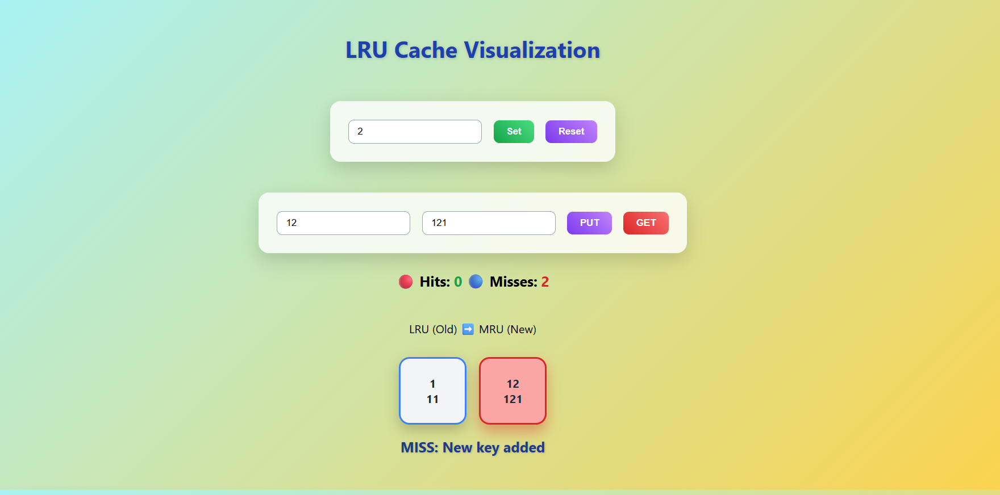

# Algorithm Visualizer 🔄

This project visualizes the working of **LRU Cache** and **Sorting Algorithms** using **HTML, CSS, and JavaScript**.  
It is designed to help learners understand how these algorithms work **step-by-step** with **interactive visualizations**.

---

## **Features**

### **LRU Cache**
- Live cache operations  
- **PUT** and **GET** functionality  
- Visual representation of cache order  
- Cache **HIT & MISS** indication  
- Beginner-friendly implementation  
- Cache capacity can be set dynamically  

### **Sorting Algorithms**
- Visualizes common sorting algorithms:  
  - **Bubble Sort**  
  - **Selection Sort**  
  - **Insertion Sort**  
  - **Merge Sort**  
  - **Quick Sort**  
- Step-by-step animation of **comparisons, swaps, and sorted elements**  
- Dynamic array input  
- Displays **number of comparisons and swaps**  
- Interactive and beginner-friendly  

---

## **Tech Stack**
- **HTML5** – Page structure  
- **CSS3** – Styling, gradients, and animations  
- **JavaScript (Vanilla)** – Algorithm logic and visualization  
- **No external libraries** – Lightweight and easy to understand  

---

## **How It Works**

### **LRU Cache**
- Most recently used items move to the **right**  
- Least recently used items are removed when cache capacity is full  
- Cache **hits** and **misses** are highlighted with **green/red colors**  
- Cache updates are displayed **in real-time**  

### **Sorting Algorithms**
- User inputs an array of numbers  
- Each algorithm visualizes the **sorting process using bars**  
- **Comparisons** and **swaps** are highlighted dynamically  
- **Sorted elements** are highlighted in **green**, active comparisons in **red**  
- Supports **dynamic scaling** for large numbers  

---

## **Screenshots**

### **LRU Cache**

### **Sorting Visualizer**

---

## **Author**
**Alekhya Lokula** – Full Stack & DSA Enthusiast   
 

---

## **Live Demo**
https://23wh1a0549.github.io/dsa-visualizer/

